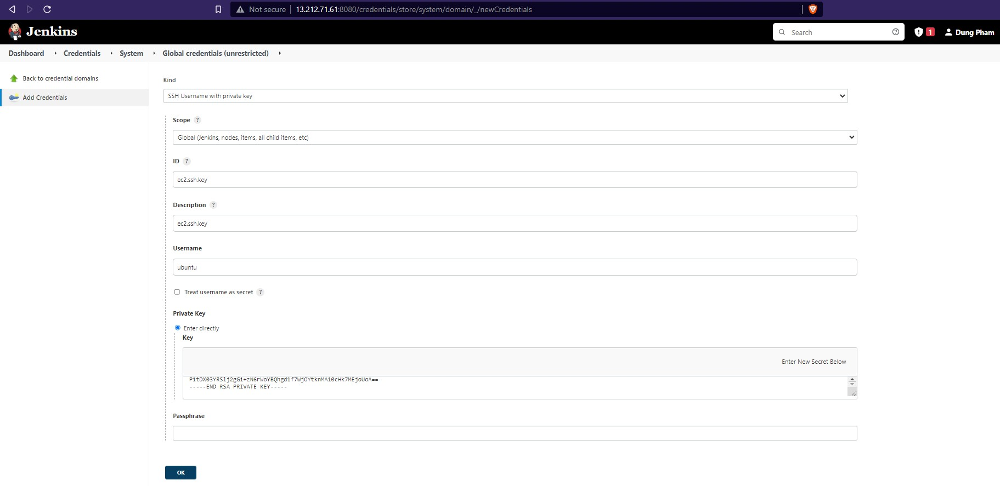
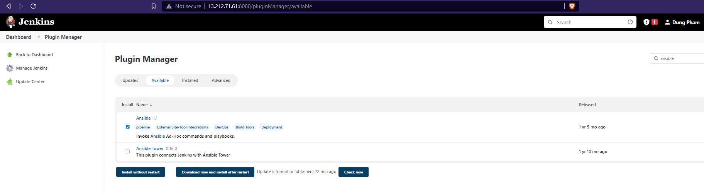
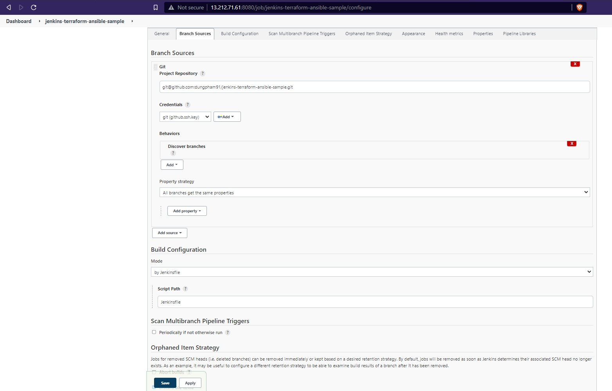
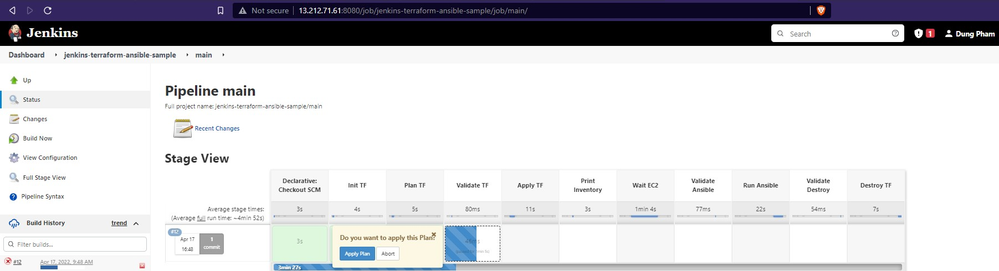
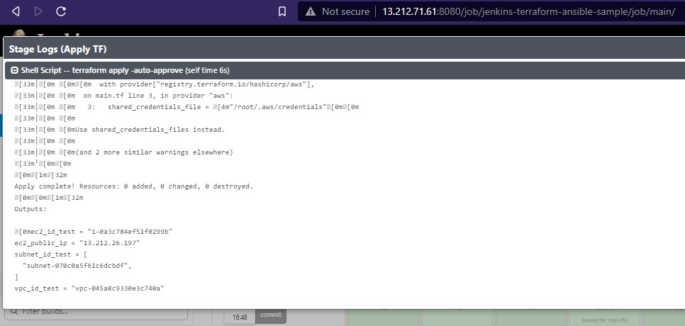

# Auto deploy an app with Jenkins - Terraform -  Ansible

In this sample, we will be automating almost all the steps in the automatic installation of a new Docker server.

Some of the goals of this sample:

- Create S3 bucket to store state for main Terraform code.
- Automate Terraform to create EC2 with Jenkins.
- Automatically generate Inventory for Ansible from Terraform output.
- Jenkins executes Ansible playbook to install Docker on newly created EC2.

## Table of contents
- [1. Create S3 bucket to store state](#1-create-s3-bucket-to-store-state)
    - [1.1 Install AWS CLI on your local machine](#11-install-aws-cli-on-your-local-machine)
    - [1.2 Install Terraform on your local machine](#12-install-terraform-on-your-local-machine)
    - [1.3 Create S3 bucket](#13-create-s3-bucket)
        - [1.3.1 Move into the folder `s3-backend` change the required value](#131-move-into-the-folder-s3-backend-change-the-required-value)
        - [1.3.2 Create S3 bucket for Terraform backend](#132-create-s3-bucket-for-terraform-backend)
- [2. Install Jenkin server](#2-install-jenkin-server)
    - [2.1 Install Jenkins with Docker Compose](#21-install-jenkins-with-docker-compose)
    - [2.2 Install Terraform, AWS CLI, Ansible inside Jenkins](#22-install-terraform-aws-cli-ansible-inside-jenkins)
- [3. Automatically create and install a Docker server](#3-automatically-create-and-install-a-docker-server)
    - [3.1 Update backend for Terraform](#31-update-backend-for-terraform)
    - [3.2 Initial setup with Jenkins](#32-initial-setup-with-jenkins)
        - [3.2.1 Jenkins credentials](#321-jenkins-credentials)
        - [3.2.2 Jenkins plugins](#322-jenkins-plugins)
        - [3.2.3 Create Jenkins Multibranch Pipeline](#323-create-jenkins-multibranch-pipeline)
- [4. Process flow in this sample](#4-process-flow-in-this-sample)
- [5. Software version](#5-software-version)


## 1. Create S3 bucket to store state

Unlike using Terraform under local, then the file `terraform.tfstate` will be saved with the Terraform code folder.

However, our goal is to automate Terraform with Jenkins so we need to save the remote state with the S3 bucket instead of local.

**`This step you can do under your local machine.`**

### 1.1 Install AWS CLI on your local machine

Follow the official guide to install and configure profiles.
- [AWS CLI Installation](https://docs.aws.amazon.com/cli/latest/userguide/cli-chap-install.html)
- [AWS CLI Configuration](https://docs.aws.amazon.com/cli/latest/userguide/cli-configure-profiles.html)

### 1.2 Install Terraform on your local machine

To install Terraform, find the appropriate package (https://www.terraform.io/downloads.html) for your system and download it.

Also, it is recommended that you use an Ubuntu computer to install Terraform by following the commands below:

```sh
$ curl -fsSL https://apt.releases.hashicorp.com/gpg | sudo apt-key add -
$ sudo apt-add-repository "deb [arch=amd64] https://apt.releases.hashicorp.com $(lsb_release -cs) main"
$ sudo apt-get update && sudo apt-get install terraform
```

### 1.3 Create S3 bucket

#### 1.3.1 Move into the folder `s3-backend` change the required value

- Change the `region` value and your `project` name in the file [s3-backend/variables.tf](./s3-backend/variables.tf)

- Change the path `shared_credentials_files` to the credentials file on your computer in file [s3-backend/main.tf](./s3-backend/main.tf)

#### 1.3.2 Create S3 bucket for Terraform backend

At the `s3-backend` directory, execute the following commands in turn:

```sh
$ terraform init
$ terraform plan # This command to check if the code has any problem, it will output the changed information to the screen
$ terraform apply # Implement resource creation
```

When the `terraform apply` command finishes, you will get an information on the terminal window like the image below. Save this information and use it in the next section.


## 2. Install Jenkin server

Here, I assume that you already have another server Ubuntu 20.04 LTS ready to install Jenkins. I'm not going to use Terraform or talk about creating a Jenkins server. This is not the main purpose of sample.

On this new server, you are ready to install:

- **`Docker`** - guide: [https://docs.docker.com/engine/install/ubuntu/](https://docs.docker.com/engine/install/ubuntu/)
- **`Docker Compose`** - guide: [https://docs.docker.com/compose/install/](https://docs.docker.com/compose/install/)

### 2.1 Install Jenkins with Docker Compose

After installing Docker and Docker Compose, create the following directory:

```sh
$ sudo mkdir -p /home/ubuntu/jenkins/jenkins_config
```

Move to directory `/home/ubuntu/jenkins` and copy the file [docker-compose.yml](./jenkins/docker-compose.yml) to this directory.

Run the following command to deploy the Jenkins application:

```sh
$ sudo docker-compose up -d
```

Next, type the following command to print the first Jenkins password string. Here, I'm not going to go into detail on how to use or set up Jenkins, learn it yourself.

```sh
$ sudo docker exec jenkins cat /var/jenkins_home/secrets/initialAdminPassword
```

Then you need to open the firewall port `8080` to be able to access the Jenkins service. After logging into Jenkins, install the recommended plugins and set up your admin account.

### 2.2 Install Terraform, AWS CLI, Ansible inside Jenkins

In fact, you can have your seprate Terraform and Ansible servers. But to keep the demo simple to implement, I installed it all inside the Jenkins container.

Login into Jenkins container:

```sh
sudo docker exec -it jenkins bash
```

Then, copy script file [install.sh](./jenkins/install.sh) into Jenkins container and execute it by the command:

```sh
bash install.sh
```

If you need to create file `install.sh` manually inside Jenkins container, may you need to install `nano` inside it too - an editor tool.

```sh
apt-get update && apt-get install -y nano
```

**`Remember to run command: `**

```sh
aws configure
```

**`to set up an IAM account for Jenkins, right after the script has finished running.`**

## 3. Automatically create and install a Docker server

In this example, the application that I want to automatically create and install on EC2 is Docker. Terraform will create an EC2, Ansible will install Docker on that EC2, and all the steps are done with Jenkins.

### 3.1 Update backend for Terraform

Take the result saved in step [1.3.2](#132-create-s3-bucket-for-terraform-backend) and put the values in the file [backend.tf](./backend.tf)

### 3.2 Initial setup with Jenkins

Some settings are needed for your Jenkins to work with this repository.

#### 3.2.1 Jenkins credentials

For Jenkins to work, you need to create two credentials as follows:

- `Github SSH Key`: Please clone or fork my sample to your github account, then add your key to the Jenkins server as image below. This key will be used so that Jenkins can connect to your repository.


- `EC2 SSH key`:
    - Similarly, in the code Terraform will automatically attach the SSH public key located in directory [modules/ec2/keyfiles/id_rsa.pub](./modules/ec2/keyfiles/id_rsa.pub) to the generated EC2. Please replace your public key in this file.
    - Next, add the SSH private key corresponding to your public key into the Jenkins server, like the image below.
    - This key will be used by Ansible to ssh into the new EC2.



#### 3.2.2 Jenkins plugins

Next, you will need to install the Ansible plugin.



#### 3.2.3 Create Jenkins Multibranch Pipeline

Now, the last step is that you create a Jenkins Multibranch Pipeline like the image below, connect to your repository using the credential that you created in step [3.2.1](#321-jenkins-credentials).

**`Also, remember to replace the region inside`** [Jenkinsfile](./Jenkinsfile) **`at line 58.`**



And that's it. Pipeline worked. Images for pipeline run:





## 4. Process flow in this sample

- `Step 1`: on your local computer, you use the Terraform [s3-backend](./s3-backend/) folder to create an S3 bucket, the purpose of which is to store the remote state for the main Terraform code - used to create EC2.

- `Step 2`:
    - You create a Jenkins server, install on that server the packages: Docker, Docker Compose.
    - Using the file [docker-compose.yml](./jenkins/docker-compose.yml) to install Jenkins.
    - In the Jenkins container, you use the [install.sh](./jenkins/install.sh) script to install the necessary packages: Terraform, AWS CLI, Ansible.

- `Step 3`: on admin Jenkins:
    - Add required SSH key to Jenkins credentials.
    - Install Ansible plugin.
    - Create pipeline for sample repository.

- `Step 4`:
    - When Jenkins runs, it will automatically execute the main Terraform code - used to create a new EC2.
    - After creating EC2, it will print EC2's public IP address into an inventory file named `aws_hosts`.
    - Also check the status of EC2 ready or not.

- `Step 5`: Jenkins through the Ansible plugin, will execute the Ansible Playbook via the [EC2 SSH Key](#321-jenkins-credentials) and the previous inventory file `aws_hosts`. It will automatically run the playbook named [ansible/docker.yml](./ansible/docker.yml)

- `Step 6`: Once all deployed, there will be a step asking if you want to delete the EC2 that was just installed. If you click OK then Jenkins will execute the job and delete it.

## 5. Software version

|  Software |  Version |
|---|---|
| Docker | 20.10.14 |
| Docker Compose | 1.29.2 |
| AWS CLI | 1.19.1 |
|  Terraform | 1.1.8 |
| Ansible | 2.10.8 |
| Jenkins | 2.332.2 |